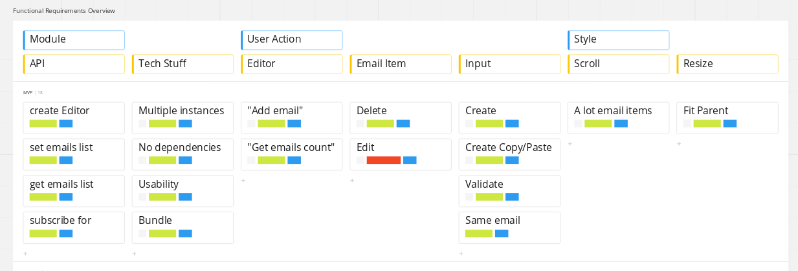

#### email editor

> please visit a [codepen.io](https://codepen.io/mialso/project/full/XJNYbN) for a working examples

#### usage
> `./dist/` folder has both **emailEditor.css**  **emailEditor.js** bundles

##### js

```
const { addEmailEditor } = EmailEditor;
const emailEditorContainer = document.getElementById('#email_editor');
const { subscribe, getEmails, setEmails } = addEmailEditor(emailEditorContainer);

// it is possible to create two different Observers:
// handle the whole state data with errors
const unsubscribeDebug = subscribe((state) => whatHappensIn(state)));
// handle only recent email list
const unsubscribeEmails = subscribe(() => handleEmailList(getEmails()));
```

##### css
**EmailEditor** fits parent `width` and `height`, please see **codepen** examples given above


##### npm repo commands
* `npm run start` - start the dev server to have the bundle and css served at **localhost:4004**
* `npm run build:dev` - get default webpack 'development' mode build output to `./dist` folder
* `npm run build` - get default webpack 'production' mode build output to `./dist` folder
* `npm run lint` - get linter result console output

#### description

##### functional overview

> for more details please visit [miro board](https://miro.com/app/board/o9J_kv8fLYY=/)

##### dependency graph


##### index
exposes `addEmailEditor` method, which is responsible for **Store** and **EmailEditor** initialization along with initial rendering

##### app.model
* manages instances of **EmailEditor** - a public interface
* manages **Store** for each **EmailEditor**, the former is a private interface for the inner data flow

##### email.model
* manages **State**, responsibile for state mutation in response to particular command
* exposes **Validator**, **Selectors** and common interface aka redux-reducer

##### controller
* composes all pieces together in order to fulfill user interaction
> the data flow is similar to `redux`: message -> reducer -> render -> handleSubscriptions
* each **View** actionable element (like button) is bounded to particular controller during **render**

##### render
* manages direct DOM manipulations in order to make UI up-to-date with **State**
* binds particular **Controller** item to actual **View** element

##### view
* holds html templates, imports css and text data

##### action
* holds constants and action creators in order to decouple **View** from **State** - pretty the same as used in redux

##### util
* `compose`, `getRandomString`, `findParentDataKey` utility functions
